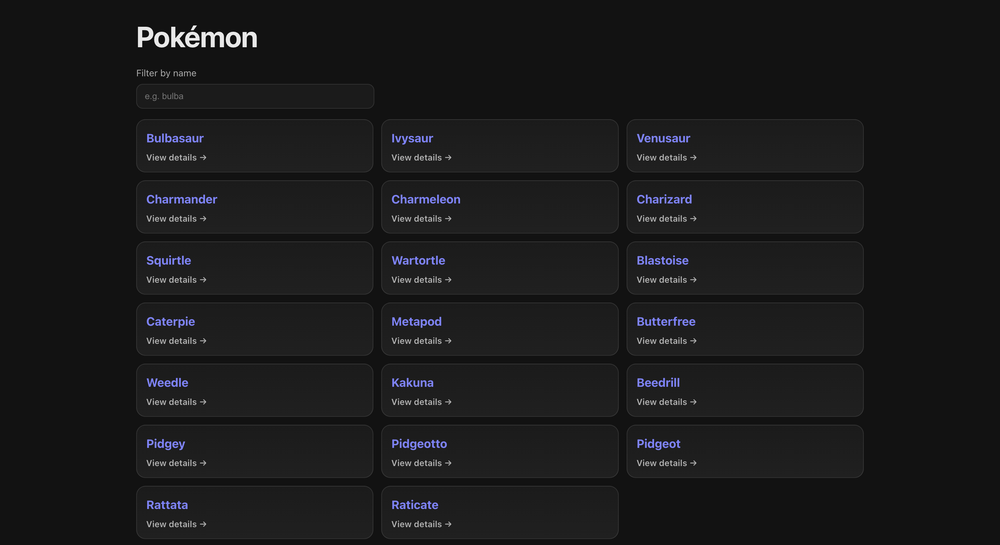
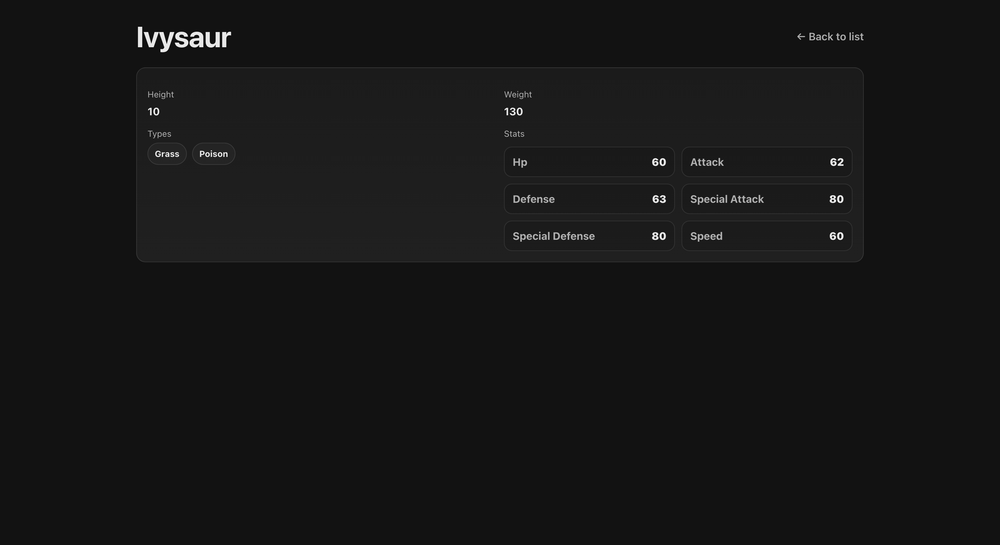

# Incubyte Frontend Engineering Kata – Pokémon App

A production-ready Pokémon web application built with **React + TypeScript** using **React Query** for data fetching and a **TDD-first** workflow with **Vitest + Testing Library + MSW**.

---

## Live Demo
**Live URL:** <PASTE_DEPLOYED_LINK_HERE>

---

## Screenshots

### Pokémon Listing Page


### Pokémon Detail Page


> Note: Create the folder `docs/screenshots/` and add the screenshots with the exact names above.

---

## Features

### 1) Pokémon Listing Page
- Fetches Pokémon list from PokeAPI
- Renders Pokémon in a grid/card layout
- Filter by name (case-insensitive, partial match)
- Loading & error handling
- Uses React Query caching for responsiveness

### 2) Pokémon Detail Page
- Navigates from list → detail on card click
- Fetches Pokémon details by route param `:name`
- Displays:
    - Name
    - Height
    - Weight
    - Types
    - Stats
- Loading & error handling (including 404)

---

## Tech Stack
- React 19 + TypeScript (Vite)
- React Router
- React Query (TanStack)
- Vitest + Testing Library
- MSW (Mock Service Worker)

---

## Setup Instructions

### Prerequisites
- Node.js (LTS recommended)
- npm

### Install
```bash
npm install